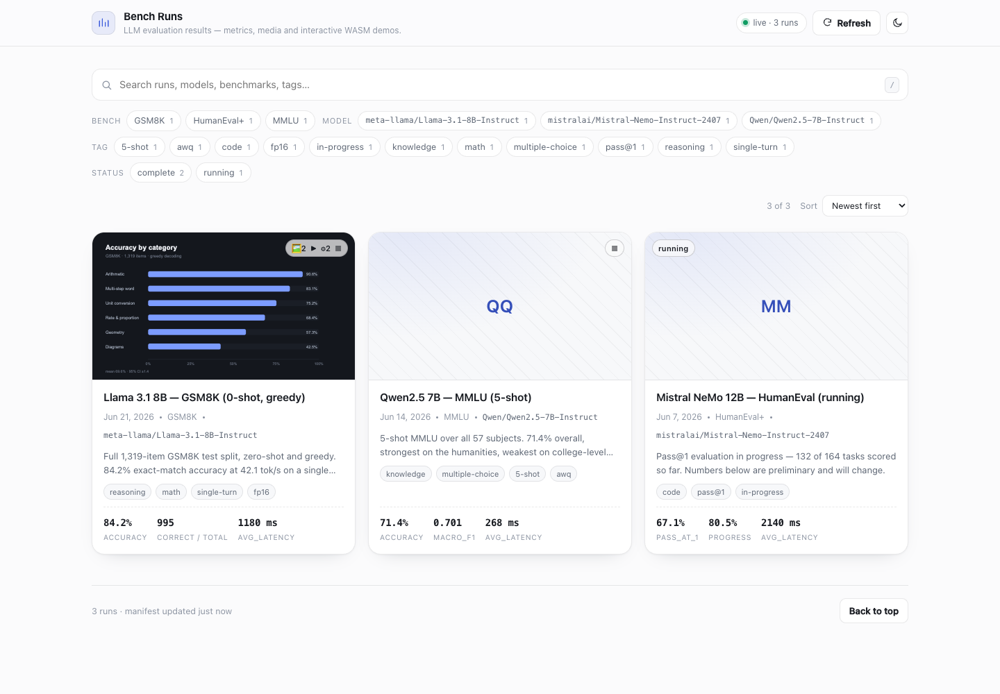

# Bench Runs

A static site for LLM benchmark results. Drop a folder into `public/results/`, push,
and the published page picks it up on its own — no rebuild step to remember, no
database, no tracker.

Each run can carry **metrics**, **charts**, **images**, **video**, **CSV tables**,
**markdown notes** and **playable demos** (WebAssembly or a self-contained HTML build).

```
public/results/<run-id>/
├── run.json          ← what to show
├── notes.md          ← optional long-form notes (markdown)
└── media/            ← images, video, .wasm modules, playable builds
```



---

## Quick start

```bash
npm run dev        # build the manifest, then serve http://127.0.0.1:4173
npm run new -- "Llama 3.1 8B — GSM8K" --model meta-llama/Llama-3.1-8B-Instruct --benchmark GSM8K
npm run manifest   # regenerate public/data/results.json
npm run serve      # static server only
npm test           # optional: headless-Chrome smoke test (needs Chrome)
```

No dependencies — Node 18+ is all that is required.

Three example runs ship with the repo so the page is not empty on first open.
Delete `public/results/2026-*` once your own results are in.

---

## Publishing a run

```bash
# 1. scaffold
npm run new -- "Qwen3 14B — MATH" --model Qwen/Qwen3-14B --benchmark MATH

# 2. drop your assets into the new folder's media/ and describe them in run.json

# 3. preview
npm run dev

# 4. publish
git add -A && git commit -m "results: qwen3-14b math" && git push
```

GitHub Actions rebuilds the manifest and redeploys Pages. Open tabs notice within
`pollSeconds` (default 30 s) without a reload, show a *“1 new result published”*
toast and badge the new cards **NEW**.

### How the live update works

| Layer | Mechanism |
| --- | --- |
| On push | `.github/workflows/publish.yml` runs `build-manifest.mjs`, rebuilds `results.json`, deploys `public/` to Pages |
| Open page | Polls `data/results.json` every `pollSeconds`, and immediately on tab focus, on `online`, and when you press <kbd>R</kbd> |
| Cache busting | The manifest is fetched with a unique query string; media URLs carry a per-run content hash (`?v=…`) so re-uploaded assets never come back stale |

Pages caches edge responses for ~10 minutes, but because the page requests
`results.json?t=<timestamp>` the browser/CDN is forced to revalidate that one file.
Uploaded media always gets a fresh URL. If you *replace* an asset in place with
different bytes, the content hash changes and the URL changes with it.

---

## `run.json` reference

Only `title` really matters — everything else is optional.

```jsonc
{
  "id": "2026-06-21_example-llama31-8b-gsm8k",  // defaults to the folder name
  "title": "Llama 3.1 8B — GSM8K (0-shot, greedy)",
  "model": "meta-llama/Llama-3.1-8B-Instruct",
  "benchmark": "GSM8K",
  "date": "2026-06-21T10:12:00Z",     // falls back to a YYYY-MM-DD folder prefix
  "status": "complete",                // complete | running | failed | partial
  "tags": ["reasoning", "math"],
  "summary": "One or two sentences shown on the card.",

  // ── numbers, rendered as tiles ─────────────────────────────────────────
  "metrics": {
    "accuracy": { "value": 0.842, "unit": "%", "hint": "exact match", "better": true },
    "tokens_per_sec": 42.1,
    "avg_latency": { "value": 1180, "unit": "ms" }
  },

  // ── inline SVG charts ──────────────────────────────────────────────────
  "charts": [{
    "title": "Latency vs. output length",
    "type": "line",                    // line | bar
    "x": ["64", "128", "192"],
    "yLabel": "ms",
    "yMin": 0, "yMax": 1000,           // optional explicit domain
    "series": [
      { "name": "p50", "values": [212, 318, 402] },
      { "name": "p95", "values": [318, 402, 486], "color": "#f0b849" }
    ]
  }],

  "environment": { "gpu": "RTX 4090", "backend": "vLLM 0.6.3" },
  "links": [{ "label": "Full log", "href": "https://…" }],

  "media": [ /* see below */ ],

  "notes": ""   // markdown; empty means "use notes.md from the run folder"
}
```

A metric `{ "unit": "%" }` with a value ≤ 1 is multiplied by 100 for display
(`0.842` → `84.2%`). Anything unparseable is printed verbatim, so
`{ "value": ">1h" }` is fine too.

---

## Media entries

All `src` paths are relative to the run folder. Anything with a `http(s)://` URL is
passed through untouched.

| `type` | Fields | Notes |
| --- | --- | --- |
| `image` | `src`, `caption`, `alt`, `wide` | Lazy-loaded; click opens a lightbox |
| `video` | `src`, `poster`, `caption`, `sources[]`, `loop`, `muted`, `aspect` | YouTube/Vimeo URLs are embedded automatically |
| `audio` | `src`, `caption` | Native player |
| `playable` | `kind`, `src` or `wasm`+`glue`, `caption`, `aspect`, `resolution`, `params`, `maxIter`, `interactive`, `animated` | Click-to-load; sandboxed |
| `table` | `src` (CSV/TSV) **or** `columns`+`rows`, `caption` | CSV is parsed at build time and inlined |
| `markdown` | `text` **or** `src`, `caption` | Small markdown subset, safely escaped |
| `code` | `text` **or** `src`, `caption` | Monospace block |
| `file` | `src`, `label`, `caption` | Download link with a size hint |

```jsonc
"media": [
  { "type": "image", "src": "media/accuracy.png", "caption": "Accuracy by category" },
  { "type": "video", "src": "media/demo.mp4", "poster": "media/demo.jpg" },
  { "type": "table", "src": "media/metrics.csv" },
  { "type": "markdown", "text": "Rerun with `--seed 7` changed nothing." },
  { "type": "file",  "src": "logs/run.log", "label": "Raw log" }
]
```

Text assets under 200 KB (`.md`, `.csv`, `.log`, `.json`, …) are inlined into the
manifest, so notes and tables render instantly with no extra request. Files that are
missing on disk are flagged at build time by `npm run manifest` and rendered as a
“⚠ file missing” placeholder instead of a broken image.

---

## Playable demos

**Option A — a self-contained build** (Godot, Unity, Emscripten, …). Point at its
entry HTML; it runs in a sandboxed iframe:

```jsonc
{ "type": "playable", "kind": "iframe", "src": "media/playable/index.html", "aspect": "16 / 9" }
```

**Option B — a bare WebAssembly module.** The page ships a generic loader at
`public/wasm-loader.js` implementing a small contract:

```c
unsigned char *framebuffer(void);                       // RGBA bytes, w*h*4
int render(int w, int h, double cx, double cy, double scale, int max_iter);
```

Your module also needs to export `memory`. The loader then gives you a canvas with
**drag to pan / wheel to zoom**, and `resolution` from the media item sets the
render size:

```jsonc
{
  "type": "playable", "kind": "wasm",
  "wasm": "media/mandel.wasm",   // "glue": "media/custom-loader.js" to override
  "resolution": [720, 480],
  "aspect": "3 / 2",
  "maxIter": 240
}
```

`params: [...]` is passed verbatim after `w, h` if your `render` has its own
signature — it also disables the built-in pan/zoom. A module that only exports
`main` is instantiated and started, and you get a note that nothing is drawn.
Host imports can be declared with `"imports": { "env": { "log": "log", "seed": 42 } }`.

The example run contains a 923-byte hand-compiled mandelbrot renderer
(`public/results/2026-06-21_example-*/media/mandel.c`) built with:

```bash
clang --target=wasm32 -nostdlib -O2 -Wl,--no-entry \
  -Wl,--export=framebuffer -Wl,--export=render -Wl,--export=memory \
  -o mandel.wasm mandel.c
```

For a custom interface, write your own `glue` module exporting
`default(mountElement, { wasmUrl, run, item })`.

---

## Deployment

1. Push this repo to GitHub.
2. **Settings → Pages → Build and deployment → Source: GitHub Actions.**
3. Push anything under `public/` — the workflow deploys the site.

Every path in the app is relative, so it works whether it is served from
`https://user.github.io/repo/` or a custom domain root.

---

## Configuration

Edit the `window.BENCH_CONFIG` block near the top of `public/index.html`:

| Key | Default | Meaning |
| --- | --- | --- |
| `title` / `subtitle` | `Bench Runs` | Header branding |
| `manifest` | `data/results.json` | Manifest location |
| `repoUrl` | `''` | Adds a **GitHub** button to the header |
| `pollSeconds` | `30` | Auto-refresh interval; `0` disables polling |
| `showJson` | `true` | Per-run `run.json` button |

Keyboard: <kbd>/</kbd> search · <kbd>T</kbd> theme · <kbd>R</kbd> refresh ·
<kbd>Esc</kbd> close. Filter chips are OR within a group and AND across groups.
The theme follows the system preference until you toggle it manually.

---

## Repo layout

```
.github/workflows/publish.yml   CI: build manifest → deploy Pages
public/                         ← the deployed site
├── index.html  app.js  styles.css  wasm-loader.js  favicon.svg
├── data/results.json           generated manifest (committed, rebuilt by CI)
└── results/<run-id>/run.json …  your results
scripts/
├── build-manifest.mjs          scan results → manifest (+ warnings)
├── new-run.mjs                 scaffold a run folder
├── serve.mjs                   dependency-free static server
└── smoke-test.mjs              headless-Chrome end-to-end check of the UI
```
